# Clinly - Arquitetura Event-Driven (EDA)

> Documento oficial da arquitetura orientada a eventos do Clinly.
> Microserviços comunicando exclusivamente via RabbitMQ.

---

## Sumario

1. [Visao Geral](#1-visao-geral)
2. [Convencoes de Nomenclatura](#2-convencoes-de-nomenclatura)
3. [Topologia RabbitMQ](#3-topologia-rabbitmq)
4. [Fluxos](#4-fluxos)
   - Fluxo 1: Cadastro de Usuario
   - Fluxo 2: Atualizacao de Usuario
   - Fluxo 3: Alteracao de Roles
   - Fluxo 4: Remocao de Usuario
   - Fluxo 5: Paciente Criado
   - Fluxo 6: Paciente Atualizado
   - Fluxo 7: Paciente Removido
   - Fluxo 8: Consulta Criada
   - Fluxo 9: Consulta Confirmada
   - Fluxo 10: Consulta Cancelada
   - Fluxo 11: Consulta Reagendada
   - Fluxo 12: Consulta Concluida
   - Fluxo 13: Dashboard (Consumidor)
   - Fluxo 14: Equipe (Consumidor)
   - Fluxo 15: Users (Publicador e Consumidor)
   - Fluxo 16: Consultas (Publicador e Consumidor)
   - Fluxo 17: Pacientes (Publicador e Consumidor)
5. [Tabela Resumo](#5-tabela-resumo)

---

## 1. Visao Geral

### Microservicos

| Microservico | Porta | Responsabilidade |
|---|---|---|
| **Gateway** | 8080 | Roteamento HTTP. Sem logica de negocio. Sem eventos. |
| **Auth** | 8081 | Autenticacao, registro, JWT. Publica eventos de usuario. |
| **Users** | 8082 | Perfil do usuario, roles, configuracoes. |
| **Pacientes** | 8083 | Cadastro e gestao de pacientes. |
| **Consultas** | 8084 | Agendamento e gestao de consultas. |
| **Dashboard** | 8085 | Estatisticas e indicadores em tempo real. |
| **Equipe** | 8086 | Gestao de equipe e vinculos. |
| **Relatorios** | 8087 | Relatorios consolidados e graficos. |

### Regras Fundamentais

- **Gateway** apenas roteia HTTP. Nao publica, nao consome, nao possui logica de negocio.
- Toda comunicacao entre microserviços ocorre via **RabbitMQ**.
- Cada microservico e dono da sua **Exchange**.
- Cada microservico e responsavel pelo seu **RabbitConfig**, **Producers**, **Consumers**, **Queues** e **Bindings**.
- Eventos representam **fatos do dominio**, nao operacoes de banco de dados.
- Roles determinam o comportamento do sistema: `ADMIN`, `PROFISSIONAL`, `SECRETARIA`, `PACIENTE`.

### Fluxo Geral

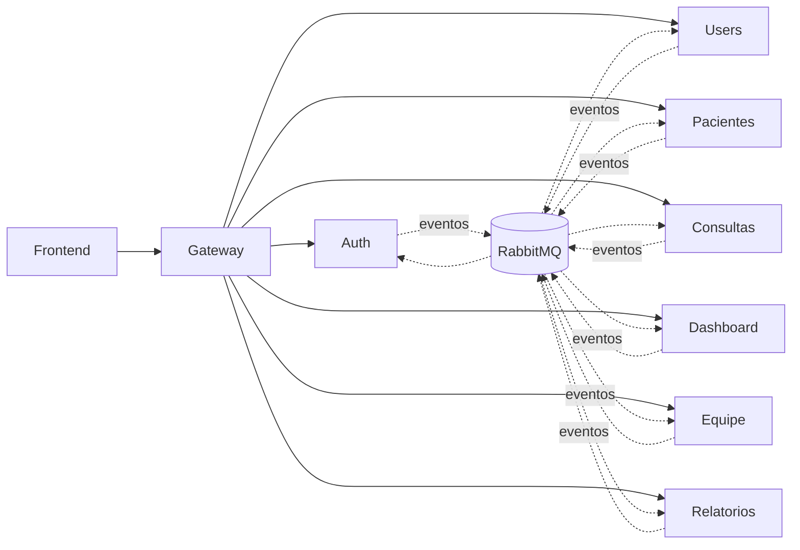

---

## 2. Convencoes de Nomenclatura

### Exchanges

| Exchange | Tipo | Microservico Dono |
|---|---|---|
| `auth.exchange` | Direct | Auth |
| `users.exchange` | Direct | Users |
| `pacientes.exchange` | Direct | Pacientes |
| `consultas.exchange` | Direct | Consultas |
| `dashboard.exchange` | Direct | Dashboard |
| `equipe.exchange` | Direct | Equipe |
| `relatorios.exchange` | Direct | Relatorios |

### Routing Keys

Padrao: `<entidade>.<acao>`

| Routing Key | Significado |
|---|---|
| `user.created` | Usuario registrado com sucesso |
| `user.updated` | Dados do usuario atualizados |
| `user.deleted` | Usuario removido do sistema |
| `user.role.changed` | Role do usuario alterada |
| `patient.created` | Paciente cadastrado |
| `patient.updated` | Dados do paciente atualizados |
| `patient.deleted` | Paciente removido |
| `appointment.created` | Consulta criada |
| `appointment.confirmed` | Consulta confirmada |
| `appointment.canceled` | Consulta cancelada |
| `appointment.rescheduled` | Consulta reagendada |
| `appointment.finished` | Consulta concluida |

### Queues

Padrao: `<consumidor>.<producer>.<evento>.queue`

| Queue | Consumidor | Exemplo |
|---|---|---|
| `dashboard.auth.user.created.queue` | Dashboard | Consome `user.created` de `auth.exchange` |
| `equipe.auth.user.created.queue` | Equipe | Consome `user.created` de `auth.exchange` |
| `users.auth.user.created.queue` | Users | Consome `user.created` de `auth.exchange` |

---

## 3. Topologia RabbitMQ

```mermaid
flowchart TB
    subgraph Auth["Auth Service"]
        AE["auth.exchange"]
    end

    subgraph Users["Users Service"]
        UE["users.exchange"]
    end

    subgraph Pacientes["Pacientes Service"]
        PE["pacientes.exchange"]
    end

    subgraph Consultas["Consultas Service"]
        CE["consultas.exchange"]
    end

    subgraph Dashboard["Dashboard Service"]
        DE["dashboard.exchange"]
    end

    subgraph Equipe["Equipe Service"]
        EE["equipe.exchange"]
    end

    subgraph Relatorios["Relatorios Service"]
        RE["relatorios.exchange"]
    end

    %% Auth Exchange
    AE -->|user.created| Q1["dashboard.auth.user.created.queue"]
    AE -->|user.created| Q2["equipe.auth.user.created.queue"]
    AE -->|user.created| Q3["users.auth.user.created.queue"]
    AE -->|user.created| Q4["pacientes.auth.user.created.queue"]
    AE -->|user.created| Q5["consultas.auth.user.created.queue"]

    AE -->|user.updated| Q6["dashboard.auth.user.updated.queue"]
    AE -->|user.updated| Q7["users.auth.user.updated.queue"]
    AE -->|user.updated| Q8["equipe.auth.user.updated.queue"]

    AE -->|user.deleted| Q9["dashboard.auth.user.deleted.queue"]
    AE -->|user.deleted| Q10["users.auth.user.deleted.queue"]
    AE -->|user.deleted| Q11["equipe.auth.user.deleted.queue"]
    AE -->|user.deleted| Q12["pacientes.auth.user.deleted.queue"]
    AE -->|user.deleted| Q13["consultas.auth.user.deleted.queue"]

    AE -->|user.role.changed| Q14["dashboard.auth.user.role.changed.queue"]
    AE -->|user.role.changed| Q15["equipe.auth.user.role.changed.queue"]
    AE -->|user.role.changed| Q16["users.auth.user.role.changed.queue"]
    AE -->|user.role.changed| Q17["consultas.auth.user.role.changed.queue"]

    %% Pacientes Exchange
    PE -->|patient.created| Q18["dashboard.pacientes.patient.created.queue"]
    PE -->|patient.created| Q19["consultas.pacientes.patient.created.queue"]
    PE -->|patient.created| Q20["relatorios.pacientes.patient.created.queue"]

    PE -->|patient.updated| Q21["dashboard.pacientes.patient.updated.queue"]
    PE -->|patient.updated| Q22["consultas.pacientes.patient.updated.queue"]

    PE -->|patient.deleted| Q23["dashboard.pacientes.patient.deleted.queue"]
    PE -->|patient.deleted| Q24["consultas.pacientes.patient.deleted.queue"]
    PE -->|patient.deleted| Q25["relatorios.pacientes.patient.deleted.queue"]

    %% Consultas Exchange
    CE -->|appointment.created| Q26["dashboard.consultas.appointment.created.queue"]
    CE -->|appointment.created| Q27["pacientes.consultas.appointment.created.queue"]
    CE -->|appointment.created| Q28["relatorios.consultas.appointment.created.queue"]

    CE -->|appointment.confirmed| Q29["dashboard.consultas.appointment.confirmed.queue"]
    CE -->|appointment.confirmed| Q30["pacientes.consultas.appointment.confirmed.queue"]

    CE -->|appointment.canceled| Q31["dashboard.consultas.appointment.canceled.queue"]
    CE -->|appointment.canceled| Q32["pacientes.consultas.appointment.canceled.queue"]

    CE -->|appointment.rescheduled| Q33["dashboard.consultas.appointment.rescheduled.queue"]
    CE -->|appointment.rescheduled| Q34["pacientes.consultas.appointment.rescheduled.queue"]

    CE -->|appointment.finished| Q35["dashboard.consultas.appointment.finished.queue"]
    CE -->|appointment.finished| Q36["pacientes.consultas.appointment.finished.queue"]
    CE -->|appointment.finished| Q37["relatorios.consultas.appointment.finished.queue"]
```

---

## 4. Fluxos

---

### Fluxo 1: Cadastro de Usuario

**Evento:** `UserCreatedEvent`

**Producer:** Auth
**Exchange:** `auth.exchange`
**Routing Key:** `user.created`

**Evento de dominio:** Um novo usuario foi registrado e autenticado com sucesso no sistema.

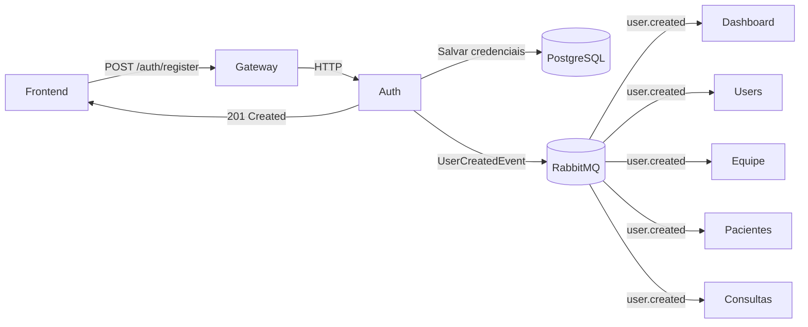

#### RabbitMQ Detalhado

| Campo | Valor |
|---|---|
| **Producer** | Auth |
| **Exchange** | `auth.exchange` (Direct) |
| **Routing Key** | `user.created` |
| **Evento** | `UserCreatedEvent` |

#### Consumidores e Reacoes

| Consumer | Queue | O que faz | Motivo |
|---|---|---|---|
| **Users** | `users.auth.user.created.queue` | Cria perfil do usuario, define roles, cria configuracoes iniciais | O servico Users e o dono do dominio "perfil do usuario". Precisa espelhar os dados de identidade para o seu contexto. |
| **Dashboard** | `dashboard.auth.user.created.queue` | Incrementa contagem de usuarios, registra atividade | O dashboard precisa de metricas atualizadas em tempo real. |
| **Equipe** | `equipe.auth.user.created.queue` | Cria vinculo do usuario com a equipe quando necessario | Se o usuario for PROFISSIONAL ou SECRETARIA, ele deve aparecer na equipe. |
| **Pacientes** | `pacientes.auth.user.created.queue` | Cria registro de paciente apenas se `role == PACIENTE` | Reacao condicional: somente usuarios com perfil de paciente devem ser rastreados neste contexto. |
| **Consultas** | `consultas.auth.user.created.queue` | Cria estrutura necessaria apenas se `role == PROFISSIONAL` | Profissionais precisam ser vinculados a agenda de consultas. |

---

### Fluxo 2: Atualizacao de Usuario

**Evento:** `UserUpdatedEvent`

**Producer:** Auth
**Exchange:** `auth.exchange`
**Routing Key:** `user.updated`

**Evento de dominio:** Dados de identidade de um usuario foram alterados (nome, email, telefone).

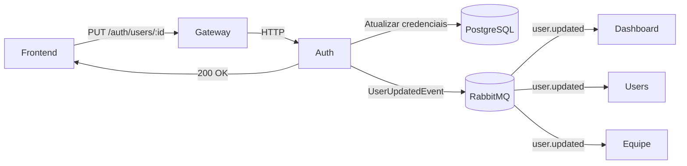

#### RabbitMQ Detalhado

| Campo | Valor |
|---|---|
| **Producer** | Auth |
| **Exchange** | `auth.exchange` (Direct) |
| **Routing Key** | `user.updated` |
| **Evento** | `UserUpdatedEvent` |

#### Consumidores e Reacoes

| Consumer | Queue | O que faz | Motivo |
|---|---|---|---|
| **Users** | `users.auth.user.updated.queue` | Atualiza perfil do usuario (nome, email, telefone) | Sincroniza dados de identidade no contexto de perfil. |
| **Dashboard** | `dashboard.auth.user.updated.queue` | Registra atividade de atualizacao | Trilha de auditoria e feed de atividades do dashboard. |
| **Equipe** | `equipe.auth.user.updated.queue` | Atualiza dados exibidos na equipe (nome, email) | A equipe exibe informacoes do usuario que precisam estar atualizadas. |

---

### Fluxo 3: Alteracao de Roles

**Evento:** `UserRoleChangedEvent`

**Producer:** Auth
**Exchange:** `auth.exchange`
**Routing Key:** `user.role.changed`

**Evento de dominio:** A role de um usuario foi alterada. Exemplo: SECRETARIA -> PROFISSIONAL.

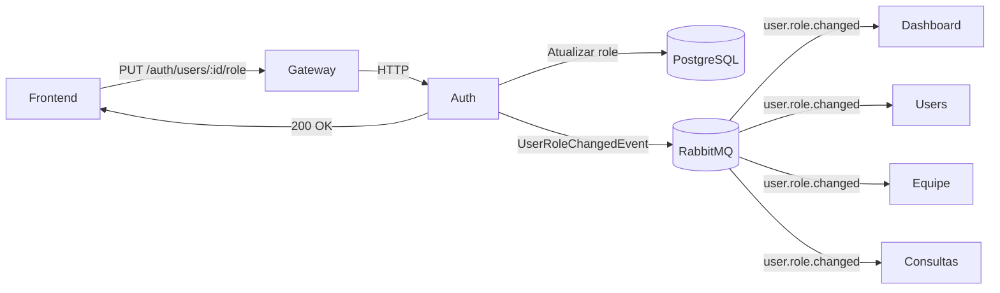

#### RabbitMQ Detalhado

| Campo | Valor |
|---|---|
| **Producer** | Auth |
| **Exchange** | `auth.exchange` (Direct) |
| **Routing Key** | `user.role.changed` |
| **Evento** | `UserRoleChangedEvent` |

#### Consumidores e Reacoes

| Consumer | Queue | O que faz | Motivo |
|---|---|---|---|
| **Users** | `users.auth.user.role.changed.queue` | Atualiza a role no perfil do usuario | Sincroniza a nova role no contexto de perfil. |
| **Dashboard** | `dashboard.auth.user.role.changed.queue` | Registra mudanca de role como atividade | Mudanca de role e um evento relevante para auditoria. |
| **Equipe** | `equipe.auth.user.role.changed.queue` | Adiciona ou remove usuario da equipe conforme nova role | Se virou PROFISSIONAL, entra na equipe. Se deixou de ser, sai. |
| **Consultas** | `consultas.auth.user.role.changed.queue` | Concede ou revoga acesso a agenda de consultas | Somente PROFISSIONAL pode criar e gerenciar consultas. |

---

### Fluxo 4: Remocao de Usuario

**Evento:** `UserDeletedEvent`

**Producer:** Auth
**Exchange:** `auth.exchange`
**Routing Key:** `user.deleted`

**Evento de dominio:** Um usuario foi removido permanentemente do sistema.

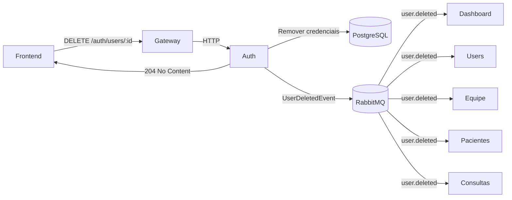

#### RabbitMQ Detalhado

| Campo | Valor |
|---|---|
| **Producer** | Auth |
| **Exchange** | `auth.exchange` (Direct) |
| **Routing Key** | `user.deleted` |
| **Evento** | `UserDeletedEvent` |

#### Consumidores e Reacoes

| Consumer | Queue | O que faz | Motivo |
|---|---|---|---|
| **Users** | `users.auth.user.deleted.queue` | Remove perfil e configuracoes do usuario | Limpeza do contexto de perfil. |
| **Dashboard** | `dashboard.auth.user.deleted.queue` | Decrementa contagem de usuarios, registra atividade | Metricas devem refletir a remocao. |
| **Equipe** | `equipe.auth.user.deleted.queue` | Remove usuario da equipe | Usuario nao existe mais no sistema. |
| **Pacientes** | `pacientes.auth.user.deleted.queue` | Remove registro de paciente associado | Limpeza do contexto de paciente. |
| **Consultas** | `consultas.auth.user.deleted.queue` | Remove vinculos com consultas, cancela agendamentos futuros | Consistencia: usuario removido nao pode ter consultas ativas. |

---

### Fluxo 5: Paciente Criado

**Evento:** `PatientCreatedEvent`

**Producer:** Pacientes
**Exchange:** `pacientes.exchange`
**Routing Key:** `patient.created`

**Evento de dominio:** Um novo paciente foi cadastrado no sistema.

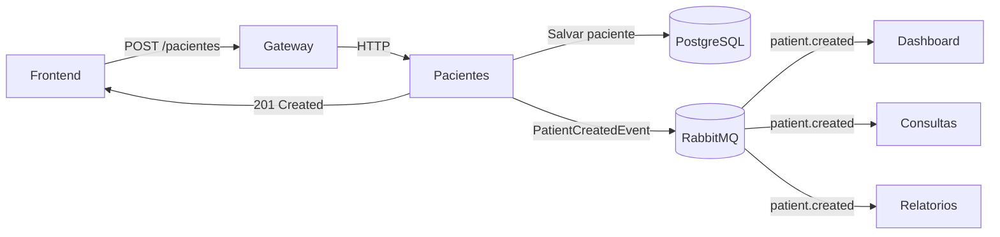

#### RabbitMQ Detalhado

| Campo | Valor |
|---|---|
| **Producer** | Pacientes |
| **Exchange** | `pacientes.exchange` (Direct) |
| **Routing Key** | `patient.created` |
| **Evento** | `PatientCreatedEvent` |

#### Consumidores e Reacoes

| Consumer | Queue | O que faz | Motivo |
|---|---|---|---|
| **Dashboard** | `dashboard.pacientes.patient.created.queue` | Incrementa contagem de pacientes, registra atividade | Metricas do dashboard precisam refletir o novo paciente. |
| **Consultas** | `consultas.pacientes.patient.created.queue` | Indexa paciente para uso na criacao de consultas | O servico de consultas precisa saber quais pacientes existem para vincular a consultas. |
| **Relatorios** | `relatorios.pacientes.patient.created.queue` | Atualiza dados consolidados de pacientes | Relatorios precisam de contagens atualizadas. |

---

### Fluxo 6: Paciente Atualizado

**Evento:** `PatientUpdatedEvent`

**Producer:** Pacientes
**Exchange:** `pacientes.exchange`
**Routing Key:** `patient.updated`

**Evento de dominio:** Dados de um paciente foram alterados.

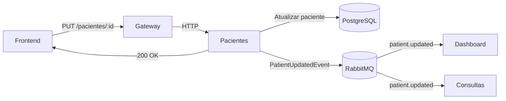

#### RabbitMQ Detalhado

| Campo | Valor |
|---|---|
| **Producer** | Pacientes |
| **Exchange** | `pacientes.exchange` (Direct) |
| **Routing Key** | `patient.updated` |
| **Evento** | `PatientUpdatedEvent` |

#### Consumidores e Reacoes

| Consumer | Queue | O que faz | Motivo |
|---|---|---|---|
| **Dashboard** | `dashboard.pacientes.patient.updated.queue` | Registra atividade de atualizacao | Trilha de auditoria no feed de atividades. |
| **Consultas** | `consultas.pacientes.patient.updated.queue` | Sincroniza dados do paciente nas consultas vinculadas | Se o nome do paciente mudou, a consulta deve refletir o dado atualizado. |

---

### Fluxo 7: Paciente Removido

**Evento:** `PatientDeletedEvent`

**Producer:** Pacientes
**Exchange:** `pacientes.exchange`
**Routing Key:** `patient.deleted`

**Evento de dominio:** Um paciente foi removido do sistema.

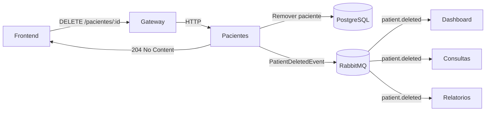

#### RabbitMQ Detalhado

| Campo | Valor |
|---|---|
| **Producer** | Pacientes |
| **Exchange** | `pacientes.exchange` (Direct) |
| **Routing Key** | `patient.deleted` |
| **Evento** | `PatientDeletedEvent` |

#### Consumidores e Reacoes

| Consumer | Queue | O que faz | Motivo |
|---|---|---|---|
| **Dashboard** | `dashboard.pacientes.patient.deleted.queue` | Decrementa contagem de pacientes, registra atividade | Metricas devem refletir a remocao. |
| **Consultas** | `consultas.pacientes.patient.deleted.queue` | Remove ou arquiva consultas vinculadas ao paciente | Consistencia: paciente removido nao pode ter consultas ativas. |
| **Relatorios** | `relatorios.pacientes.patient.deleted.queue` | Atualiza dados consolidados | Relatorios devem excluir dados do paciente removido. |

---

### Fluxo 8: Consulta Criada

**Evento:** `AppointmentCreatedEvent`

**Producer:** Consultas
**Exchange:** `consultas.exchange`
**Routing Key:** `appointment.created`

**Evento de dominio:** Uma nova consulta foi agendada no sistema.

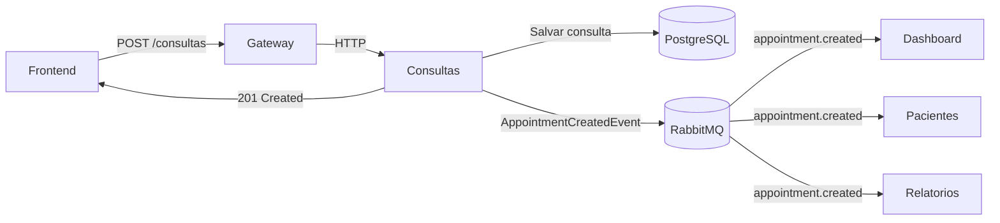

#### RabbitMQ Detalhado

| Campo | Valor |
|---|---|
| **Producer** | Consultas |
| **Exchange** | `consultas.exchange` (Direct) |
| **Routing Key** | `appointment.created` |
| **Evento** | `AppointmentCreatedEvent` |

#### Consumidores e Reacoes

| Consumer | Queue | O que faz | Motivo |
|---|---|---|---|
| **Dashboard** | `dashboard.consultas.appointment.created.queue` | Incrementa contagem de consultas, registra atividade | Metricas de consultas em tempo real. |
| **Pacientes** | `pacientes.consultas.appointment.created.queue` | Registra consulta no historico do paciente | O paciente precisa ver suas consultas agendadas. |
| **Relatorios** | `relatorios.consultas.appointment.created.queue` | Atualiza dados consolidados de consultas | Relatorios de produtividade e agendamento. |

---

### Fluxo 9: Consulta Confirmada

**Evento:** `AppointmentConfirmedEvent`

**Producer:** Consultas
**Exchange:** `consultas.exchange`
**Routing Key:** `appointment.confirmed`

**Evento de dominio:** Uma consulta foi confirmada pelo profissional ou pela secretaria.

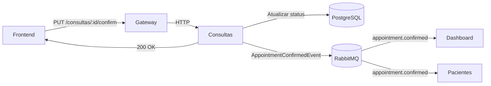

#### RabbitMQ Detalhado

| Campo | Valor |
|---|---|
| **Producer** | Consultas |
| **Exchange** | `consultas.exchange` (Direct) |
| **Routing Key** | `appointment.confirmed` |
| **Evento** | `AppointmentConfirmedEvent` |

#### Consumidores e Reacoes

| Consumer | Queue | O que faz | Motivo |
|---|---|---|---|
| **Dashboard** | `dashboard.consultas.appointment.confirmed.queue` | Atualiza metricas de confirmacao | Indicador de taxa de confirmacao de consultas. |
| **Pacientes** | `pacientes.consultas.appointment.confirmed.queue` | Notifica paciente sobre confirmacao | O paciente deve saber que sua consulta foi confirmada. |

---

### Fluxo 10: Consulta Cancelada

**Evento:** `AppointmentCanceledEvent`

**Producer:** Consultas
**Exchange:** `consultas.exchange`
**Routing Key:** `appointment.canceled`

**Evento de dominio:** Uma consulta foi cancelada.

#### RabbitMQ Detalhado

| Campo | Valor |
|---|---|
| **Producer** | Consultas |
| **Exchange** | `consultas.exchange` (Direct) |
| **Routing Key** | `appointment.canceled` |
| **Evento** | `AppointmentCanceledEvent` |

#### Consumidores e Reacoes

| Consumer | Queue | O que faz | Motivo |
|---|---|---|---|
| **Dashboard** | `dashboard.consultas.appointment.canceled.queue` | Atualiza metricas de cancelamento | Indicador de taxa de cancelamento. Alerta se taxa estiver alta. |
| **Pacientes** | `pacientes.consultas.appointment.canceled.queue` | Notifica paciente sobre cancelamento | O paciente deve saber que sua consulta foi cancelada. |

---

### Fluxo 11: Consulta Reagendada

**Evento:** `AppointmentRescheduledEvent`

**Producer:** Consultas
**Exchange:** `consultas.exchange`
**Routing Key:** `appointment.rescheduled`

**Evento de dominio:** Uma consulta foi reagendada para nova data/hora.

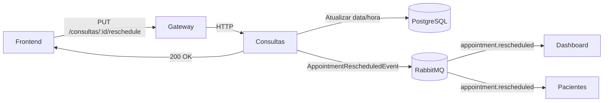

#### RabbitMQ Detalhado

| Campo | Valor |
|---|---|
| **Producer** | Consultas |
| **Exchange** | `consultas.exchange` (Direct) |
| **Routing Key** | `appointment.rescheduled` |
| **Evento** | `AppointmentRescheduledEvent` |

#### Consumidores e Reacoes

| Consumer | Queue | O que faz | Motivo |
|---|---|---|---|
| **Dashboard** | `dashboard.consultas.appointment.rescheduled.queue` | Registra atividade de reagendamento | Trilha de auditoria e metricas de reagendamento. |
| **Pacientes** | `pacientes.consultas.appointment.rescheduled.queue` | Notifica paciente sobre nova data/hora | O paciente deve ser informado da mudanca. |

---

### Fluxo 12: Consulta Concluida

**Evento:** `AppointmentFinishedEvent`

**Producer:** Consultas
**Exchange:** `consultas.exchange`
**Routing Key:** `appointment.finished`

**Evento de dominio:** Uma consulta foi concluida com sucesso.

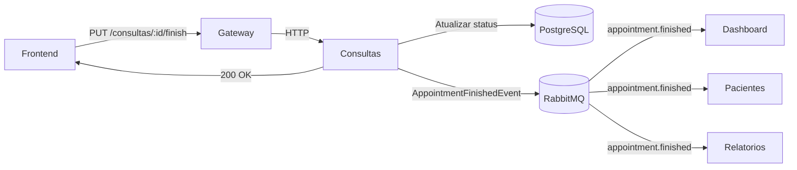

#### RabbitMQ Detalhado

| Campo | Valor |
|---|---|
| **Producer** | Consultas |
| **Exchange** | `consultas.exchange` (Direct) |
| **Routing Key** | `appointment.finished` |
| **Evento** | `AppointmentFinishedEvent` |

#### Consumidores e Reacoes

| Consumer | Queue | O que faz | Motivo |
|---|---|---|---|
| **Dashboard** | `dashboard.consultas.appointment.finished.queue` | Atualiza metricas de conclusao, registra atividade | Indicador de produtividade e taxa de conclusao. |
| **Pacientes** | `pacientes.consultas.appointment.finished.queue` | Registra conclusao no historico do paciente | O paciente precisa ver consultas concluidas no seu historico. |
| **Relatorios** | `relatorios.consultas.appointment.finished.queue` | Atualiza dados consolidados para relatorios | Relatorios de produtividade por profissional e periodo. |

---

### Fluxo 13: Dashboard (Consumidor)

O Dashboard e o maior consumidor de eventos do sistema. Seu papel e manter metricas e indicadores atualizados em tempo real.

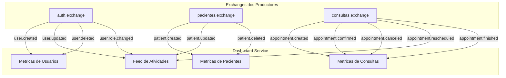

#### Todos os Eventos Consumidos

| Evento | Exchange | Routing Key | Queue | O que o Dashboard faz | Motivo |
|---|---|---|---|---|---|
| `UserCreatedEvent` | `auth.exchange` | `user.created` | `dashboard.auth.user.created.queue` | Incrementa total de usuarios | Metrica: total de usuarios ativos |
| `UserUpdatedEvent` | `auth.exchange` | `user.updated` | `dashboard.auth.user.updated.queue` | Registra atividade no feed | Auditoria: rastreabilidade de alteracoes |
| `UserDeletedEvent` | `auth.exchange` | `user.deleted` | `dashboard.auth.user.deleted.queue` | Decrementa total de usuarios | Metrica: total de usuarios ativos |
| `UserRoleChangedEvent` | `auth.exchange` | `user.role.changed` | `dashboard.auth.user.role.changed.queue` | Registra atividade no feed | Auditoria: mudancas de permissao |
| `PatientCreatedEvent` | `pacientes.exchange` | `patient.created` | `dashboard.pacientes.patient.created.queue` | Incrementa total de pacientes | Metrica: total de pacientes cadastrados |
| `PatientUpdatedEvent` | `pacientes.exchange` | `patient.updated` | `dashboard.pacientes.patient.updated.queue` | Registra atividade no feed | Auditoria: alteracoes de paciente |
| `PatientDeletedEvent` | `pacientes.exchange` | `patient.deleted` | `dashboard.pacientes.patient.deleted.queue` | Decrementa total de pacientes | Metrica: total de pacientes ativos |
| `AppointmentCreatedEvent` | `consultas.exchange` | `appointment.created` | `dashboard.consultas.appointment.created.queue` | Incrementa total de consultas | Metrica: consultas agendadas |
| `AppointmentConfirmedEvent` | `consultas.exchange` | `appointment.confirmed` | `dashboard.consultas.appointment.confirmed.queue` | Atualiza taxa de confirmacao | Metrica: qualidade do agendamento |
| `AppointmentCanceledEvent` | `consultas.exchange` | `appointment.canceled` | `dashboard.consultas.appointment.canceled.queue` | Atualiza taxa de cancelamento | Metrica: alerta de cancelamento |
| `AppointmentRescheduledEvent` | `consultas.exchange` | `appointment.rescheduled` | `dashboard.consultas.appointment.rescheduled.queue` | Registra atividade no feed | Auditoria: reagendamentos |
| `AppointmentFinishedEvent` | `consultas.exchange` | `appointment.finished` | `dashboard.consultas.appointment.finished.queue` | Incrementa consultas concluidas | Metrica: produtividade |

---

### Fluxo 14: Equipe (Consumidor)

A Equipe gerencia o vinculo dos usuarios com as equipes de trabalho.

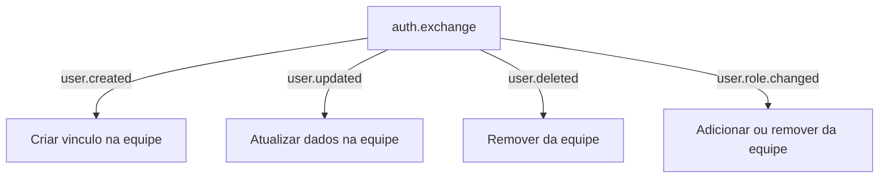

#### Todos os Eventos Consumidos

| Evento | Exchange | Routing Key | Queue | O que a Equipe faz | Motivo |
|---|---|---|---|---|---|
| `UserCreatedEvent` | `auth.exchange` | `user.created` | `equipe.auth.user.created.queue` | Cria vinculo do usuario com a equipe (se PROFISSIONAL ou SECRETARIA) | Novos membros devem aparecer na equipe |
| `UserUpdatedEvent` | `auth.exchange` | `user.updated` | `equipe.auth.user.updated.queue` | Atualiza dados exibidos na equipe (nome, email) | Dados consistentes entre servicos |
| `UserDeletedEvent` | `auth.exchange` | `user.deleted` | `equipe.auth.user.deleted.queue` | Remove usuario da equipe | Usuario removido nao pode permanecer na equipe |
| `UserRoleChangedEvent` | `auth.exchange` | `user.role.changed` | `equipe.auth.user.role.changed.queue` | Adiciona ou remove usuario da equipe conforme nova role | Somente PROFISSIONAL e SECRETARIA pertencem a equipe |

---

### Fluxo 15: Users (Publicador e Consumidor)

O servico Users e o dono do dominio "perfil do usuario". Ele consome eventos do Auth para criar e manter perfis, e pode publicar eventos quando o perfil e atualizado internamente.

#### Eventos Publicados

| Evento | Exchange | Routing Key | Quando |
|---|---|---|---|
| *(nenhum por enquanto)* | - | - | O Users service atualmente e apenas consumidor. Eventos de perfil sao publicados pelo Auth. |

#### Eventos Consumidos

| Evento | Exchange | Routing Key | Queue | O que o Users faz | Motivo |
|---|---|---|---|---|---|
| `UserCreatedEvent` | `auth.exchange` | `user.created` | `users.auth.user.created.queue` | Cria perfil do usuario, define roles, cria configuracoes iniciais | O Auth e dono da identidade, o Users e dono do perfil |
| `UserUpdatedEvent` | `auth.exchange` | `user.updated` | `users.auth.user.updated.queue` | Sincroniza dados atualizados no perfil | Manter consistencia entre identidade e perfil |
| `UserDeletedEvent` | `auth.exchange` | `user.deleted` | `users.auth.user.deleted.queue` | Remove perfil e configuracoes do usuario | Limpeza dos dados do contexto de perfil |
| `UserRoleChangedEvent` | `auth.exchange` | `user.role.changed` | `users.auth.user.role.changed.queue` | Atualiza a role no perfil do usuario | Sincronizacao da role entre Auth e Users |

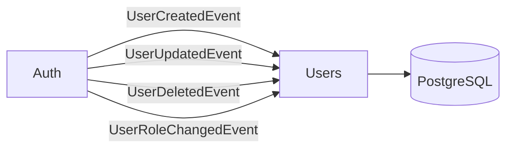

---

### Fluxo 16: Consultas (Publicador e Consumidor)

O servico Consultas e o dono do dominio "agendamento de consultas". Publica eventos de ciclo de vida das consultas e consome eventos de usuarios e pacientes.

#### Eventos Publicados

| Evento | Exchange | Routing Key | Quando |
|---|---|---|---|
| `AppointmentCreatedEvent` | `consultas.exchange` | `appointment.created` | Nova consulta agendada |
| `AppointmentConfirmedEvent` | `consultas.exchange` | `appointment.confirmed` | Consulta confirmada |
| `AppointmentCanceledEvent` | `consultas.exchange` | `appointment.canceled` | Consulta cancelada |
| `AppointmentRescheduledEvent` | `consultas.exchange` | `appointment.rescheduled` | Consulta reagendada |
| `AppointmentFinishedEvent` | `consultas.exchange` | `appointment.finished` | Consulta concluida |

#### Eventos Consumidos

| Evento | Exchange | Routing Key | Queue | O que Consultas faz | Motivo |
|---|---|---|---|---|---|
| `UserCreatedEvent` | `auth.exchange` | `user.created` | `consultas.auth.user.created.queue` | Cria estrutura para profissional (se role == PROFISSIONAL) | Profissionais precisam ser vinculados a agenda |
| `UserDeletedEvent` | `auth.exchange` | `user.deleted` | `consultas.auth.user.deleted.queue` | Remove vinculos, cancela agendamentos futuros | Consistencia dados |
| `UserRoleChangedEvent` | `auth.exchange` | `user.role.changed` | `consultas.auth.user.role.changed.queue` | Concede ou revoga acesso a agenda | Somente PROFISSIONAL pode gerenciar consultas |
| `PatientCreatedEvent` | `pacientes.exchange` | `patient.created` | `consultas.pacientes.patient.created.queue` | Indexa paciente para uso em consultas | Precisa saber quais pacientes existem |
| `PatientUpdatedEvent` | `pacientes.exchange` | `patient.updated` | `consultas.pacientes.patient.updated.queue` | Sincroniza dados do paciente nas consultas | Dados consistentes |
| `PatientDeletedEvent` | `pacientes.exchange` | `patient.deleted` | `consultas.pacientes.patient.deleted.queue` | Remove ou arquiva consultas do paciente | Consistencia |

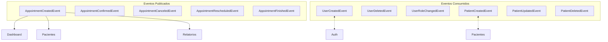

---

### Fluxo 17: Pacientes (Publicador e Consumidor)

O servico Pacientes e o dono do dominio "cadastro de pacientes". Publica eventos do ciclo de vida dos pacientes e consome eventos de usuarios e consultas.

#### Eventos Publicados

| Evento | Exchange | Routing Key | Quando |
|---|---|---|---|
| `PatientCreatedEvent` | `pacientes.exchange` | `patient.created` | Novo paciente cadastrado |
| `PatientUpdatedEvent` | `pacientes.exchange` | `patient.updated` | Dados do paciente atualizados |
| `PatientDeletedEvent` | `pacientes.exchange` | `patient.deleted` | Paciente removido |

#### Eventos Consumidos

| Evento | Exchange | Routing Key | Queue | O que Pacientes faz | Motivo |
|---|---|---|---|---|---|
| `UserCreatedEvent` | `auth.exchange` | `user.created` | `pacientes.auth.user.created.queue` | Cria registro de paciente (se role == PACIENTE) | Somente usuarios com perfil de paciente |
| `UserDeletedEvent` | `auth.exchange` | `user.deleted` | `pacientes.auth.user.deleted.queue` | Remove registro de paciente associado | Limpeza dos dados |
| `AppointmentCreatedEvent` | `consultas.exchange` | `appointment.created` | `pacientes.consultas.appointment.created.queue` | Registra consulta no historico do paciente | Paciente precisa ver suas consultas |
| `AppointmentConfirmedEvent` | `consultas.exchange` | `appointment.confirmed` | `pacientes.consultas.appointment.confirmed.queue` | Atualiza status da consulta no historico | Historico preciso |
| `AppointmentCanceledEvent` | `consultas.exchange` | `appointment.canceled` | `pacientes.consultas.appointment.canceled.queue` | Atualiza status da consulta no historico | Historico preciso |
| `AppointmentRescheduledEvent` | `consultas.exchange` | `appointment.rescheduled` | `pacientes.consultas.appointment.rescheduled.queue` | Atualiza data/hora da consulta no historico | Historico preciso |
| `AppointmentFinishedEvent` | `consultas.exchange` | `appointment.finished` | `pacientes.consultas.appointment.finished.queue` | Registra conclusao no historico | Historico completo |

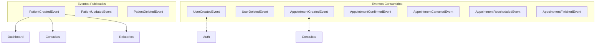

---

## 5. Tabela Resumo

| Evento | Producer | Consumers | Exchange | Routing Key | Queue(s) |
|---|---|---|---|---|---|
| `UserCreatedEvent` | Auth | Users, Dashboard, Equipe, Pacientes, Consultas | `auth.exchange` | `user.created` | `users.auth.user.created.queue`, `dashboard.auth.user.created.queue`, `equipe.auth.user.created.queue`, `pacientes.auth.user.created.queue`, `consultas.auth.user.created.queue` |
| `UserUpdatedEvent` | Auth | Users, Dashboard, Equipe | `auth.exchange` | `user.updated` | `users.auth.user.updated.queue`, `dashboard.auth.user.updated.queue`, `equipe.auth.user.updated.queue` |
| `UserRoleChangedEvent` | Auth | Users, Dashboard, Equipe, Consultas | `auth.exchange` | `user.role.changed` | `users.auth.user.role.changed.queue`, `dashboard.auth.user.role.changed.queue`, `equipe.auth.user.role.changed.queue`, `consultas.auth.user.role.changed.queue` |
| `UserDeletedEvent` | Auth | Users, Dashboard, Equipe, Pacientes, Consultas | `auth.exchange` | `user.deleted` | `users.auth.user.deleted.queue`, `dashboard.auth.user.deleted.queue`, `equipe.auth.user.deleted.queue`, `pacientes.auth.user.deleted.queue`, `consultas.auth.user.deleted.queue` |
| `PatientCreatedEvent` | Pacientes | Dashboard, Consultas, Relatorios | `pacientes.exchange` | `patient.created` | `dashboard.pacientes.patient.created.queue`, `consultas.pacientes.patient.created.queue`, `relatorios.pacientes.patient.created.queue` |
| `PatientUpdatedEvent` | Pacientes | Dashboard, Consultas | `pacientes.exchange` | `patient.updated` | `dashboard.pacientes.patient.updated.queue`, `consultas.pacientes.patient.updated.queue` |
| `PatientDeletedEvent` | Pacientes | Dashboard, Consultas, Relatorios | `pacientes.exchange` | `patient.deleted` | `dashboard.pacientes.patient.deleted.queue`, `consultas.pacientes.patient.deleted.queue`, `relatorios.pacientes.patient.deleted.queue` |
| `AppointmentCreatedEvent` | Consultas | Dashboard, Pacientes, Relatorios | `consultas.exchange` | `appointment.created` | `dashboard.consultas.appointment.created.queue`, `pacientes.consultas.appointment.created.queue`, `relatorios.consultas.appointment.created.queue` |
| `AppointmentConfirmedEvent` | Consultas | Dashboard, Pacientes | `consultas.exchange` | `appointment.confirmed` | `dashboard.consultas.appointment.confirmed.queue`, `pacientes.consultas.appointment.confirmed.queue` |
| `AppointmentCanceledEvent` | Consultas | Dashboard, Pacientes | `consultas.exchange` | `appointment.canceled` | `dashboard.consultas.appointment.canceled.queue`, `pacientes.consultas.appointment.canceled.queue` |
| `AppointmentRescheduledEvent` | Consultas | Dashboard, Pacientes | `consultas.exchange` | `appointment.rescheduled` | `dashboard.consultas.appointment.rescheduled.queue`, `pacientes.consultas.appointment.rescheduled.queue` |
| `AppointmentFinishedEvent` | Consultas | Dashboard, Pacientes, Relatorios | `consultas.exchange` | `appointment.finished` | `dashboard.consultas.appointment.finished.queue`, `pacientes.consultas.appointment.finished.queue`, `relatorios.consultas.appointment.finished.queue` |
